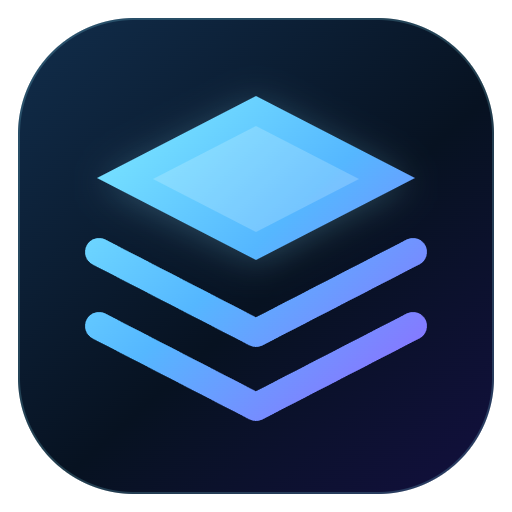

<p align="center">
  
</p>

<h1 align="center">Nexus Game Launcher</h1>

<p align="center">
  Sua biblioteca de jogos em um aplicativo para Windows: capas, controle, estatísticas e proteção automática de saves.
</p>

<p align="center">
  <a href="https://github.com/MateusSouzaAlves/GameHubPessoal/releases/latest">
    
  </a>
</p>

<p align="center">
  <a href="https://github.com/MateusSouzaAlves/GameHubPessoal/releases">Todas as versões</a>
  ·
  <a href="#primeira-configuração">Primeira configuração</a>
  ·
  <a href="#google-drive-opcional">Google Drive</a>
</p>

---

## Instalação rápida

O instalador é a opção recomendada para a maioria das pessoas. Ele já contém o aplicativo completo, o ambiente necessário para executá-lo e a integração com o XOutput.

**Não é necessário instalar Node.js, npm, Git ou usar o terminal.**

1. Clique em **Baixar para Windows** acima.
2. Na versão mais recente, abra a área **Assets** e baixe `Nexus Game Launcher Setup 1.0.0.exe`.
3. Abra o arquivo baixado e aguarde a instalação automática.
4. Ao terminar, abra o **Nexus Game Launcher** pelo menu Iniciar ou pelo atalho criado no Windows.

> O Windows pode exibir o Microsoft Defender SmartScreen enquanto o projeto ainda não possuir um certificado comercial de assinatura. Confira se o arquivo veio deste repositório antes de escolher **Mais informações → Executar assim mesmo**.

### O que o instalador deixa pronto

- Nexus Game Launcher instalado como um programa normal do Windows.
- Todos os componentes de execução necessários incluídos.
- XOutput e sua licença incluídos, sem configurações pessoais de controles.
- Pasta privada para catálogo, capas, análises e backups de saves.
- Atalhos para abrir o aplicativo novamente sem usar comandos.
- Desinstalação disponível pelas configurações de aplicativos do Windows.

## Versão portátil

Quem não quiser instalar pode baixar `Nexus Game Launcher 1.0.0.exe` na mesma página de Releases. A versão portátil abre diretamente e oferece os mesmos recursos principais.

Ela ainda cria uma pasta privada de dados do usuário no Windows. “Portátil” significa que o aplicativo não passa pelo instalador; não significa que saves, capas e preferências serão gravados ao lado do executável.

## Requisitos para usar

- Windows 10 ou Windows 11 de 64 bits.
- Aproximadamente 300 MB livres para instalação, cache e funcionamento inicial.
- Conexão com a internet apenas para buscar capas e usar a sincronização do Google Drive.
- Para emulação de controle com XOutput, os drivers pedidos pelo próprio XOutput, como ViGEmBus quando aplicável.

## Primeira configuração

Depois de abrir o Nexus pela primeira vez:

1. Entre em **Configurações**.
2. Clique em **Adicionar pasta**.
3. Selecione a pasta que contém seus jogos. Cada jogo deve estar, de preferência, em sua própria subpasta.
4. Aguarde a análise. O Nexus escolherá o executável mais provável e procurará a melhor capa disponível.
5. Conecte um controle, se desejar. A navegação é reconhecida automaticamente pela Gamepad API.

Para um jogo com saves em um local incomum, abra os detalhes do jogo e use **Adicionar pasta de save**. A partir daí, essa pasta participa dos backups automáticos.

## Recursos incluídos

- Descoberta de jogos com análise de nome, estrutura, tamanho e tipo de executável.
- Identificação de App ID da Steam e capas locais ou obtidas pela Steam.
- Detecção de saves em pastas do jogo, Documents/My Games, Saved Games, AppData e Steam userdata.
- Backups ZIP incrementais ao fechar um jogo e em intervalos configuráveis.
- Histórico de versões com restauração segura.
- Tempo total jogado, sessões, últimas execuções e falhas.
- Navegação por teclado ou controle, animação de entrada e sons de interface.
- XOutput integrado com configuração preservada separadamente para cada usuário.
- Sincronização opcional de backups, capas, catálogo e métricas com o Google Drive.

## Google Drive opcional

Nenhuma conta ou credencial do Google vem dentro do aplicativo. Cada pessoa conecta a própria conta localmente.

1. Crie ou selecione um projeto no [Google Cloud Console](https://console.cloud.google.com/).
2. Ative a **Google Drive API**.
3. Configure a tela de consentimento OAuth. Enquanto o projeto estiver em teste, adicione sua conta em **Usuários de teste**.
4. Crie um **ID do cliente OAuth** do tipo **Aplicativo para computador** e baixe o JSON.
5. No Nexus, abra **Configurações → Google Drive → Importar OAuth JSON**.
6. Clique em **Entrar com Google** e conclua o login no navegador.
7. Mantenha a sincronização automática ativa ou use **Sincronizar agora**.

O Nexus utiliza apenas o espaço privado `appDataFolder` do Drive. O JSON OAuth e os tokens são criptografados localmente com o armazenamento seguro do Windows e nunca são enviados ao repositório ou incluídos no instalador.

## Privacidade e segurança

Os dados ficam normalmente em `%APPDATA%\Nexus Game Launcher\data`:

- catálogo e preferências;
- capas em cache;
- análises de uso locais;
- versões de backup dos saves;
- credenciais Google criptografadas;
- configuração local do XOutput.

O aplicativo não possui servidor próprio nem envia telemetria. O estado sincronizado exclui caminhos de executáveis e outras informações locais desnecessárias.

O Electron é executado com isolamento de contexto e sandbox. Navegação externa, pop-ups e permissões da interface são bloqueados, e a restauração de backups valida tamanho, formato e caminhos antes de escrever arquivos.

Não publique credenciais ou saves em issues. Consulte [SECURITY.md](SECURITY.md) para reportar uma vulnerabilidade.

## Para desenvolvedores

Esta seção é necessária apenas para quem deseja alterar o código-fonte.

### Preparar o projeto

```powershell
git clone https://github.com/MateusSouzaAlves/GameHubPessoal.git
cd GameHubPessoal
npm install
npm start
```

Requisitos de desenvolvimento: Node.js 20 ou superior e npm.

### Verificar e gerar os executáveis

```powershell
npm run check
npm test
npm run build
```

O build cria em `dist/`:

- `Nexus Game Launcher Setup 1.0.0.exe` — instalador recomendado;
- `Nexus Game Launcher 1.0.0.exe` — versão portátil.

### Publicar o botão de download

O botão no início deste README aponta para a versão mais recente em **GitHub Releases**. Para disponibilizar uma nova versão ao público:

1. Execute os testes e `npm run build`.
2. Crie uma nova Release no GitHub, por exemplo `v1.0.0`.
3. Anexe os dois arquivos `.exe` gerados em `dist/`.
4. Publique a Release como versão mais recente.

Assim, visitantes encontram o download oficial sem clonar o projeto ou executar comandos.

## XOutput e licenças

O executável em `vendor/XOutput` pertence ao projeto [XOutput](https://github.com/csutorasa/XOutput) e usa licença MIT. O repositório original está arquivado e não recebe novas correções.

O Nexus nunca empacota o `settings.json` do desenvolvedor. Versão, checksum e atribuições estão em [THIRD_PARTY_NOTICES.md](THIRD_PARTY_NOTICES.md).

O código do Nexus é disponibilizado sob a [licença MIT](LICENSE).
